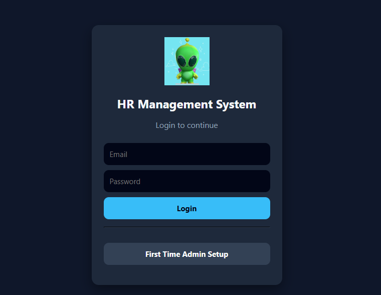
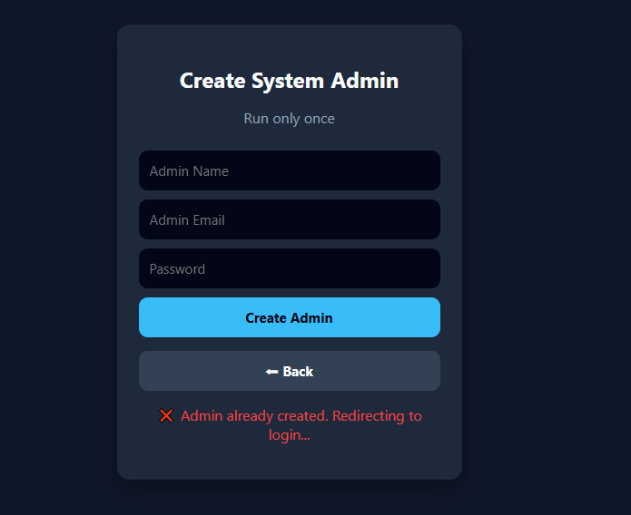
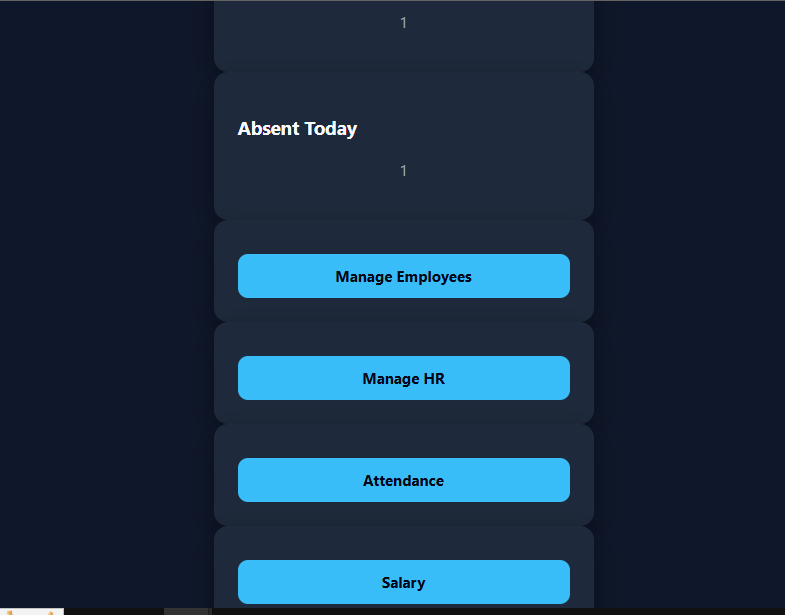
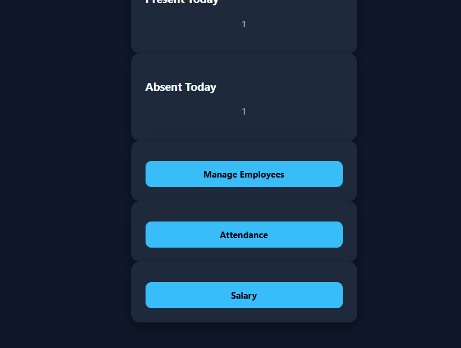
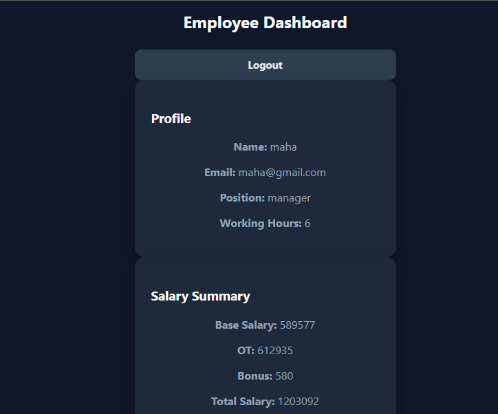
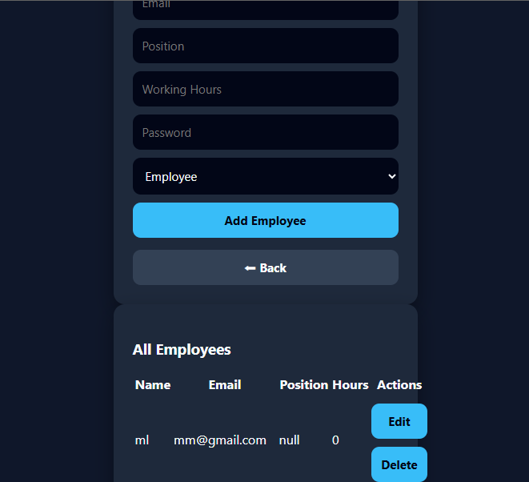
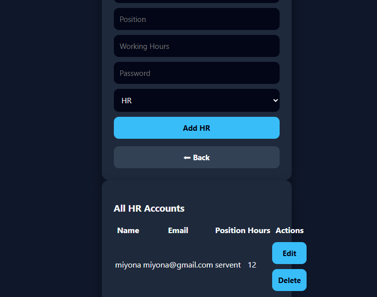
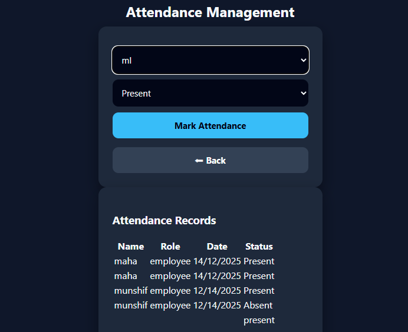
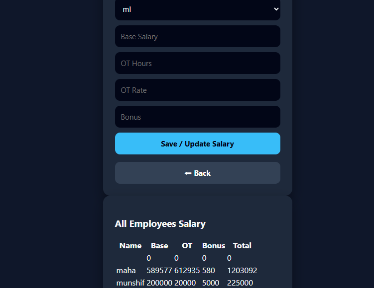

# 🏢 Mini HR Management System – Full Stack Web Application

---

## 🚀 Project Overview
The **Mini HR Management System** is a full-stack web application designed to manage core human resource operations such as employee management, attendance tracking, salary handling, and role-based access control.

This project demonstrates strong skills in **web development, database integration, authentication, and system design**, making it highly suitable for academic submissions and professional portfolios.

🔗 **Live Demo:**  
https://hr-system-f8a2f.web.app/

---

## 🎯 Purpose of the Project
- Demonstrate practical implementation of an HR system  
- Apply authentication and role-based access control  
- Integrate a real-time backend using Firebase  
- Showcase full-stack development skills in a single project  

---

## 🌟 Key Highlights
- Role-based dashboards (Admin / HR / Employee)  
- Secure authentication system  
- Real-time data handling with Firebase  
- Clean and user-friendly UI  
- Fully deployed and live project  

---

## 🧩 System Roles & Capabilities

### 👑 Admin
- Create first admin account  
- Manage HR accounts  
- Add, edit, and delete employees  
- View attendance and salary details  

### 🧑‍💼 HR
- Manage employee records  
- Mark and view attendance  
- Update and manage salary details  

### 👨‍💻 Employee
- View personal profile  
- View salary details  

---

## 🛠 Tech Stack
| Technology | Purpose |
|----------|---------|
| HTML | Page structure |
| CSS | Styling and layout |
| JavaScript | Client-side logic |
| Firebase Authentication | Secure login system |
| Firebase Firestore | Real-time database |
| Firebase Hosting | Live deployment |

---

## 📸 Screenshots Gallery

| Screenshot | Description |
|----------|-------------|
|  | **Login Page** – Secure authentication entry point |
|  | **Admin Creation Page** – First admin setup |
|  | **Admin Dashboard** – Central admin controls |
|  | **HR Dashboard** – HR management features |
|  | **Employee Dashboard** – Employee profile & salary |
|  | **Employee Management** – Add/Edit/Delete employees |
|  | **HR Management** – Admin controls HR accounts |
|  | **Attendance Page** – Mark and view attendance |
|  | **Salary Page** – Salary update and viewing |

---

## 🔐 Authentication & Security
- Firebase Authentication for secure login  
- Role-based access control to restrict unauthorized access  
- Data stored securely in Firebase Firestore  

---

## 🧠 Skills Demonstrated
- Full-stack web application development  
- Firebase authentication and database integration  
- Role-based system design  
- CRUD operations  
- Deployment and hosting  
- Professional project documentation  

---

## ⚡ Challenges & Solutions

### Challenges
- Managing multiple user roles  
- Connecting multiple pages to a single backend  
- Securing sensitive HR data  

### Solutions
- Implemented Firebase Authentication and Firestore rules  
- Used structured role-based dashboards  
- Centralized database design for scalability  

---

## 🔮 Future Improvements
- Advanced analytics and reports  
- Payroll automation  
- Email notifications  
- Export reports as PDF/Excel  
- UI enhancements with charts and graphs  

---

## 🎉 Conclusion
The **Mini HR Management System** is a complete, real-world full-stack application that reflects strong technical skills in **web development, authentication, database management, and deployment**.

It serves as an excellent **portfolio project** and a solid foundation for expanding into a production-level HR system.

